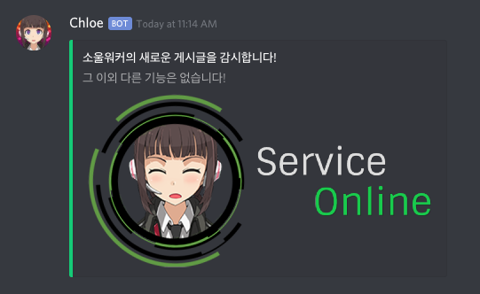
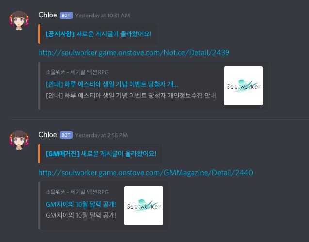
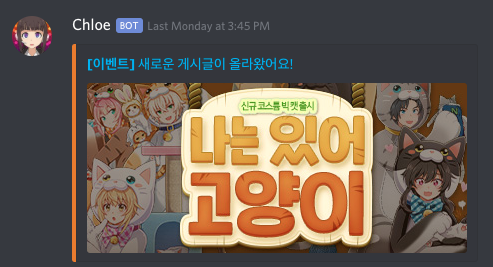
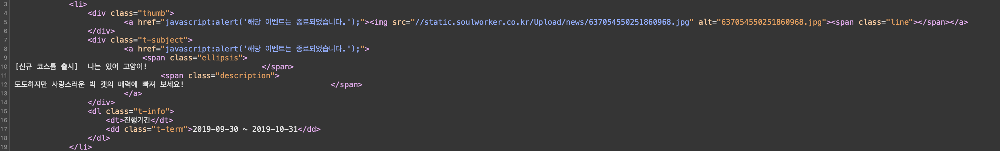

# Soulworker Monitoring Bot for Discord

* Bot Name: `Chloe`
* Permission: Only sending text and file(discord integer: `51200`)
* Bot server: Docker container on Synology DS218+

### Feature

Just Monitoring on this page, [SoulworkerKR](http://soulworker.game.onstove.com).

If bot has detected new posts, send message to default channel while this bot register on server.

Monitoring targets:
* Notice
* Update
* Event
* GM Magazine

Each 30s

### Migration

You can run this bot after modify token, [link](https://github.com/level120/GameBot/blob/master/Core/Core/Core/DiscordBot.cs#L19)

If you're using docker, please use this run command, `$ docker run -d --name CONTAINER_NAME chloe:1.0`

And please change github link or remove it. [link1](https://github.com/level120/GameBot/blob/master/start.sh#L5) and [link2](https://github.com/level120/GameBot/blob/master/Dockerfile#L7)

It's automatically build and start service when container start, it called `start.sh`)

---

# Images

### Notice, Update and GM Magazine

### Event

* A event post have only image(Not include post url)
* Because crawler have a not catching the post url(under image)
* A event page's broken url link(`javascript:alert()`)

